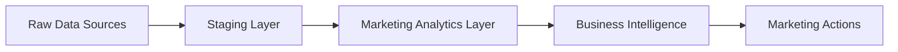

# dbt Marketing Project: Complete Data Flow Guide

## 🎯 Project Overview

This document explains how data flows through the dbt marketing analytics project from raw sources to final business insights.



## 📥 Entry Points: Source Data

### 1. **Database Sources** (Entry Point)
The project begins with three source tables in the `dbt_production` schema:

```yaml
Location: dbt_production schema in Redshift
Tables:
  - customers    # Customer master data
  - orders       # Transaction records
  - payments     # Payment details
```

**Source Configuration**: `models/sources.yml`
- Defines table schemas
- Establishes data quality tests
- Documents business context

### 2. **Data Ingestion Process**
```sql
-- Example: How dbt reads source data
SELECT * FROM {{ source('dbt_production', 'customers') }}
```

## 🔄 Data Transformation Pipeline

### Stage 1: Staging Layer (Data Standardization)

#### Purpose
Clean, standardize, and prepare raw data for analytics

#### Models
```
models/staging/
├── stg_customers.sql      # Standardizes customer fields
├── stg_orders.sql          # Enriches orders with time dimensions
├── stg_payments.sql        # Categorizes payment methods
└── stg_customer_activity.sql  # Unified activity view
```

#### Transformation Example
```sql
-- stg_orders.sql transformation
WITH source AS (
    SELECT * FROM {{ source('dbt_production', 'orders') }}
),
renamed AS (
    SELECT
        id AS order_id,
        user_id AS customer_id,
        cycle_name AS product_name,
        -- Add marketing dimensions
        CASE
            WHEN status IN ('completed', 'shipped') THEN 'successful'
            WHEN status IN ('returned', 'return_pending') THEN 'returned'
            ELSE 'pending'
        END AS order_status_group
    FROM source
)
SELECT * FROM renamed
```

### Stage 2: Marketing Analytics Layer (Business Logic)

#### Purpose
Apply complex business logic to create actionable marketing insights

#### Models
```
models/marts/marketing/
├── customer_segmentation.sql  # RFM analysis
├── product_performance.sql    # Product analytics
├── customer_cohorts.sql       # Retention analysis
└── marketing_attribution.sql  # Channel performance
```

#### Key Transformations

**1. Customer Segmentation (RFM)**
```sql
Entry: stg_customer_activity
Process:
  - Calculate Recency (days since last order)
  - Calculate Frequency (number of orders)
  - Calculate Monetary (total spend)
  - Score each dimension 1-5
  - Assign segments (Champions, At Risk, etc.)
Exit: customer_segmentation table
```

**2. Product Performance**
```sql
Entry: stg_customer_activity
Process:
  - Aggregate sales metrics
  - Calculate return rates
  - Perform ABC analysis
  - Classify product lifecycle
Exit: product_performance table
```

**3. Customer Cohorts**
```sql
Entry: stg_customer_activity
Process:
  - Group by acquisition month
  - Track retention over time
  - Calculate cohort LTV
  - Identify retention stages
Exit: customer_cohorts table
```

**4. Marketing Attribution**
```sql
Entry: stg_customer_activity
Process:
  - Assign channels to transactions
  - Calculate channel metrics
  - Score channel efficiency
  - Generate recommendations
Exit: marketing_attribution table
```

### Stage 3: Core Business Models

#### Models
```
models/
├── customers.sql  # 360-degree customer view
└── orders.sql     # Order-level analytics
```

## 🏁 Exit Points: Business Outputs

### 1. **Direct Table Access**
Marketing teams can query final tables directly:

```sql
-- Example: Get customer segments for campaign
SELECT
    customer_id,
    customer_segment,
    recommended_action
FROM dbt_marketing.customer_segmentation
WHERE customer_segment = 'Champions';
```

### 2. **Dashboard Integration**
Tables are optimized for BI tools:
- Tableau
- PowerBI
- Looker
- Custom dashboards

### 3. **Automated Actions**
Output triggers marketing automation:
```sql
-- Identify at-risk customers for retention campaign
SELECT * FROM customer_segmentation
WHERE customer_segment = 'At Risk'
AND days_since_last_order > 60;
```

## 🔧 How dbt Executes the Pipeline

### 1. **Dependency Resolution**
dbt automatically determines execution order using `ref()` and `source()` functions:

```
sources.yml defines sources
    ↓
stg_* models reference sources
    ↓
marketing models reference staging
    ↓
Final models reference everything
```

### 2. **Execution Commands**

```bash
# Full pipeline execution
dbt run

# Run specific models
dbt run --select stg_customers+  # Run model and downstream
dbt run --select +customer_segmentation  # Run model and upstream
dbt run --select staging  # Run all staging models

# Test data quality
dbt test

# Generate documentation
dbt docs generate
dbt docs serve
```

### 3. **Materialization Strategy**

```yaml
Staging Models: Materialized as VIEWS
  - Real-time data reflection
  - No storage overhead
  - Quick to rebuild

Marketing Models: Materialized as TABLES
  - Better query performance
  - Supports complex calculations
  - Scheduled refresh
```

## 📊 Data Lineage

### Complete Flow Example: Customer Lifetime Value

```
1. SOURCE: dbt_production.customers
   ↓ (extract customer_id, names)
2. STAGING: stg_customers
   ↓ (standardize fields)
3. SOURCE: dbt_production.orders
   ↓ (extract order data)
4. STAGING: stg_orders
   ↓ (enrich with time dimensions)
5. SOURCE: dbt_production.payments
   ↓ (extract payment data)
6. STAGING: stg_payments
   ↓ (convert amounts, categorize)
7. STAGING: stg_customer_activity
   ↓ (join all staging tables)
8. MART: customer_segmentation
   ↓ (calculate RFM, assign segments)
9. OUTPUT: Marketing Campaign Lists
```

## 🧪 Quality Assurance Pipeline

### Test Execution Flow
```
1. Source Tests (15+ tests)
   - Unique IDs
   - Not null constraints
   - Referential integrity

2. Staging Tests (25+ tests)
   - Transformation accuracy
   - Business rule validation
   - Data type checks

3. Model Tests (50+ tests)
   - Metric calculations
   - Segment classifications
   - Custom business logic

4. Custom Macro Tests
   - positive_value
   - percentage_range
   - recency_freshness
```

## 🚀 Typical Workflow

### Daily Execution
```bash
# 1. Morning: Full refresh
dbt run --full-refresh

# 2. Quality check
dbt test

# 3. Generate fresh docs
dbt docs generate

# 4. Snapshot for audit
dbt snapshot
```

### Development Workflow
```bash
# 1. Create feature branch
git checkout -b feature/new-model

# 2. Develop model
# Edit SQL in models/

# 3. Test locally
dbt run --select new_model
dbt test --select new_model

# 4. Check downstream impact
dbt run --select new_model+

# 5. Generate docs
dbt docs generate
dbt docs serve  # View at localhost:8080

# 6. Commit changes
git add .
git commit -m "Add new marketing model"
```

## 📈 Performance Optimization

### Query Optimization Path
```
1. Source data filtered at extraction
2. Staging views minimize computation
3. Marketing tables pre-aggregate metrics
4. Indexes on join keys (customer_id, order_id)
5. Partitioning by date for large tables
```

### Incremental Processing (Future)
```sql
{{ config(
    materialized='incremental',
    unique_key='order_id'
) }}

SELECT * FROM {{ ref('stg_orders') }}

    WHERE order_date > (SELECT MAX(order_date) FROM {{ this }})

```

## 🎯 Key Success Metrics

### Pipeline Health Indicators
- **Test Pass Rate**: Should be 100%
- **Model Runtime**: < 5 minutes for full refresh
- **Data Freshness**: < 24 hours old
- **Documentation Coverage**: 100% of models

### Business Impact Metrics
- **Segmentation Coverage**: 100% of customers classified
- **Attribution Accuracy**: All channels mapped
- **Retention Tracking**: Complete cohort history
- **Product Analytics**: All products analyzed

## 🔍 Troubleshooting Guide

### Common Issues and Solutions

1. **Source Connection Failed**
   ```bash
   dbt debug  # Check connection
   # Verify credentials in profiles.yml
   ```

2. **Model Compilation Error**
   ```bash
   dbt compile --select problem_model
   # Check SQL syntax and refs
   ```

3. **Test Failures**
   ```bash
   dbt test --select failing_model
   # Review test output for specific issues
   ```

4. **Performance Issues**
   ```bash
   dbt run --select slow_model --profile
   # Analyze query plan
   ```

## 📚 Additional Resources

### Configuration Files
- `dbt_project.yml` - Project configuration
- `profiles.yml` - Connection settings
- `packages.yml` - Dependencies
- `sources.yml` - Source definitions
- `schema.yml` - Model documentation & tests

### Documentation
- `MARKETING_DOCS.md` - Business documentation
- `CLAUDE.md` - Development guidelines
- Generated docs at `localhost:8080`

## 🎉 Summary

The dbt marketing project transforms raw transaction data into actionable marketing insights through a well-structured pipeline:

1. **Entry**: Raw data from `dbt_production` schema
2. **Processing**: Three-layer transformation (Staging → Analytics → Business)
3. **Exit**: Ready-to-use marketing analytics tables
4. **Impact**: Automated segmentation, attribution, and recommendations

The pipeline runs daily, includes 90+ quality tests, and provides complete documentation for both technical and business users.

---

*For questions or support, contact the Marketing Analytics Team*